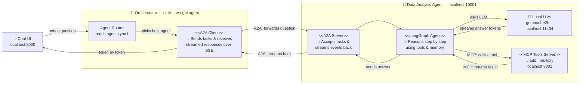
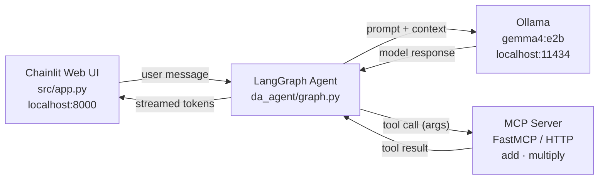

# Agentful — Local Agentic AI Starter for Engineers

> A production-ready template for building agentic AI systems with local LLMs — no API keys, no cloud costs, everything runs on your own machine.

[](https://www.python.org/)
[](LICENSE)
[](https://github.com/astral-sh/uv)

---

## What is Agentful?

**Agentful** is an engineer-facing starter template and reference implementation for building agentic AI applications backed entirely by local LLMs. It wires together the most important open protocols and frameworks in the agentic AI ecosystem **A2A**, **MCP**, **LangGraph**, and **Chainlit**  into a clean, extensible architecture you can clone and build on top of today.

Use it to:
- Learn how agentic AI systems are structured in practice
- Bootstrap a new local agent project with best-practice patterns already in place
- Experiment with A2A multi-agent orchestration and MCP tool serving without writing boilerplate


---

## Stack

| Component | Role |
|---|---|
| [Ollama](https://ollama.com/) | Serves the LLM locally via an OpenAI-compatible HTTP API |
| [Gemma 4 e2b](https://ai.google.dev/gemma/docs/core) | Lightweight quantised model (~2 GB), runs on laptop GPU or CPU |
| [LangGraph](https://github.com/langchain-ai/langgraph) | Agent reasoning loop with persistent memory and checkpointing |
| [A2A SDK](https://github.com/google-deepmind/a2a) | Agent-to-Agent protocol — standardised inter-agent communication |
| [FastMCP](https://github.com/jlowin/fastmcp) | Exposes Python functions as MCP tools over HTTP |
| [langchain-mcp-adapters](https://github.com/langchain-ai/langchain-mcp-adapters) | Discovers and wraps MCP tools for use in LangChain agents |
| [Chainlit](https://chainlit.io/) | Streaming chat web UI with per-session thread management |

---

## Architecture



### Key design patterns

| Pattern | Where | Why |
|---|---|---|
| **A2A protocol** | `src/a2a/` | Standardised agent-to-agent communication — swap or add agents without changing the orchestrator |
| **MCP tool serving** | `src/mcp/` | Tools are plain Python functions; discovery is automatic |
| **LangGraph reasoning loop** | `src/agents/da_agent/graph.py` | Persistent memory, tool-use loop, checkpointing out of the box |
| **Token streaming** | `adapter.py` → `executor_base.py` → `client.py` → `app.py` | Each LLM token is forwarded end-to-end via SSE artifact chunks |
| **Declarative agent registry** | `config/agents.yaml` | Add a new agent server without touching any Python |

---

## Prerequisites

| Requirement | Version / Notes |
|---|---|
| Python | ≥ 3.12 |
| [uv](https://github.com/astral-sh/uv) | Recommended package manager |
| [Ollama](https://ollama.com/download) | Must be running (`ollama serve`) |
| Gemma 4 e2b | Pull with `ollama pull gemma4:e2b` |

---

## Quick Start

**1. Clone**

```bash
git clone https://github.com/ai-with-ali/local-llm.git
cd local-llm
```

**2. Install dependencies**

```bash
uv sync
```

**3. Configure environment**

```bash
cp .env.example .env
```

`.env.example`:

```env
OLLAMA_SERVER_URL=http://localhost:11434
MCP_DataAnalysis_Host=localhost
MCP_DataAnalysis_Port=8001
```

**4. Start Ollama**

```bash
ollama serve
ollama pull gemma4:e2b   # first run only
```

---

## Running

Three processes must run simultaneously — open three terminals (or use the VS Code Run & Debug panel).

**Terminal 1 — MCP tool server**

```bash
uv run python -m src.mcp.server.math.server
```

Agent Card: `http://localhost:8001` (or whichever port you set in `.env`)

**Terminal 2 — Data Analysis A2A agent**

```bash
uv run python -m src.a2a.agents.da_agent --port 10001
```

Agent Card: `http://localhost:10001/.well-known/agent-card.json`

**Terminal 3 — Chainlit web UI**

```bash
uv run chainlit run main.py --port 8000
```

Open [http://localhost:8000](http://localhost:8000) in your browser.

> **VS Code users:** use the **Run & Debug** panel. Select each configuration from the dropdown and press F5.

---

## Project Structure

```
.
├── config/
│   └── agents.yaml                   # Declarative A2A agent registry
├── src/
│   ├── app.py                        # Chainlit UI — session lifecycle + message streaming
│   ├── agents/
│   │   └── da_agent/
│   │       └── graph.py              # LangGraph agent (Ollama LLM + MCP tools + MemorySaver)
│   ├── a2a/
│   │   ├── agents/
│   │   │   └── da_agent/
│   │   │       ├── adapter.py        # LangGraph → A2A stream adapter (token streaming)
│   │   │       ├── card.py           # Agent Card definition
│   │   │       ├── executor.py       # A2A executor wiring
│   │   │       └── __main__.py       # Agent server entrypoint (uvicorn)
│   │   ├── base/
│   │   │   ├── agent_base.py         # BaseA2AAgent ABC
│   │   │   ├── executor_base.py      # BaseAgentExecutor — task lifecycle + token streaming
│   │   │   ├── response_format.py    # AgentStreamChunk TypedDict
│   │   │   └── server_factory.py     # Starlette ASGI app factory
│   │   └── orchestrator/
│   │       ├── client.py             # A2AAgentClient — SSE streaming client
│   │       └── registry.py          # AgentRegistry — discovery + skill-based routing
│   └── mcp/
│       ├── client/
│       │   └── master_mcp_client.py  # MultiServerMCPClient — tool discovery
│       └── server/
│           └── math/
│               └── server.py         # FastMCP server — add() and multiply() tools
├── main.py                           # Chainlit entrypoint
├── chainlit.md                       # Chainlit welcome screen
├── pyproject.toml                    # Project metadata and dependencies
└── .env.example                      # Environment variable template
```

---

## How It Works

1. **User sends a message** in the Chainlit UI.
2. **`AgentRegistry`** reads `config/agents.yaml`, fetches each agent's Card from `/.well-known/agent-card.json`, and routes the query to the best-matching agent by skill tag.
3. **`A2AAgentClient`** opens a JSONRPC/SSE stream to the agent server.
4. **`BaseAgentExecutor`** runs the LangGraph agent and forwards events:
   - Tool call details (name + args) → `TASK_STATE_WORKING` status update
   - Tool results → `TASK_STATE_WORKING` status update
   - LLM tokens → `TaskArtifactUpdateEvent` chunks (streamed immediately)
5. **Chainlit** renders working events as a collapsible step and streams each token into the reply message in real time.

---

## Adding a New Agent

1. Create `src/agents/<your_agent>/graph.py` with your LangGraph graph.
2. Create `src/a2a/agents/<your_agent>/` mirroring the `da_agent` structure — `adapter.py`, `card.py`, `executor.py`, `__main__.py`.
3. Add the agent URL to `config/agents.yaml` — no other changes needed.

## Adding a New MCP Tool

Open `src/mcp/server/math/server.py` and add a decorated function:

```python
@mcp.tool()
def divide(a: float, b: float) -> float:
    """Divide a by b."""
    return a / b
```

Restart the MCP server — the tool is automatically discovered by the agent.

---

## Contributing

1. Fork the repository
2. Create a feature branch: `git checkout -b feat/your-feature`
3. Commit using [Conventional Commits](https://www.conventionalcommits.org/)
4. Open a pull request against `main`


---

## Overview

This project demonstrates how to build a production-style AI agent that runs entirely offline using open-weight models. It combines a LangGraph reasoning loop, MCP-based tool serving, and a Chainlit web UI into a clean, modular architecture.


---

**Stack**

| Component | Role |
|---|---|
| [Ollama](https://ollama.com/) | Serves the LLM locally via an OpenAI-compatible HTTP API |
| [Gemma 4 e4b](https://ai.google.dev/gemma/docs/core) | 4-bit quantised model (~2 GB), runs on laptop GPU or CPU |
| [LangGraph](https://github.com/langchain-ai/langgraph) | Agent reasoning loop with persistent memory and checkpointing |
| [FastMCP](https://github.com/jlowin/fastmcp) | Exposes Python functions as MCP tools over HTTP |
| [langchain-mcp-adapters](https://github.com/langchain-ai/langchain-mcp-adapters) | Discovers and wraps MCP tools for use in LangChain agents |
| [Chainlit](https://chainlit.io/) | Streaming chat web UI with per-session thread management |

---

## Architecture



Each browser session gets its own `thread_id` — conversation memory is scoped per session via LangGraph's `MemorySaver` checkpointer.

---

## Prerequisites

| Requirement | Version / Notes |
|---|---|
| Python | ≥ 3.12 |
| [uv](https://github.com/astral-sh/uv) | Recommended package manager |
| [Ollama](https://ollama.com/download) | Must be running (`ollama serve`) |
| Gemma 4 e2b | Pull with `ollama pull gemma4:e2b` |

---

## Quick Start

**1. Clone**

```bash
git clone https://github.com/ai-with-ali/local-llm.git
cd local-llm
```

**2. Install dependencies**

```bash
uv sync
```

**3. Configure environment**

```bash
cp .env.example .env
```

`.env.example`:

```env
OLLAMA_SERVER_URL=http://localhost:11434
MCP_DataAnalysis_Host=localhost
MCP_DataAnalysis_Port=8000
```

**4. Start Ollama**

```bash
ollama serve
ollama pull gemma4:e4b   # first run only
```

---

## Running

Two processes must run simultaneously.

**Terminal 1 — MCP tool server**

```bash
uv run python -m src.mcp.server.math.server
```

**Terminal 2 — Chainlit web UI**

```bash
uv run chainlit run src/app.py --port 8000
```

Open [http://localhost:8000](http://localhost:8000) in your browser. Each session maintains its own conversation history.

> **VS Code users:** use the **Run & Debug** panel. Select *"Debug MCP Math Server"* or *"Run Chainlit App"* from the dropdown and press F5.

---

## Project Structure

```
.
├── src/
│   ├── app.py                        # Chainlit UI — session lifecycle and message streaming
│   ├── agents/
│   │   └── da_agent/
│   │       └── graph.py              # LangGraph agent (Ollama + tools + MemorySaver)
│   └── mcp/
│       ├── client/
│       │   └── master_mcp_client.py  # MultiServerMCPClient — tool discovery
│       └── server/
│           └── math/
│               └── server.py         # FastMCP server — add() and multiply() tools
├── pyproject.toml                    # Project metadata and dependencies
├── .env.example                      # Environment variable template
└── chainlit.md                       # Chainlit welcome screen
```

---

## How It Works

1. **User sends a message** via the Chainlit UI.
2. **`on_message`** wraps it in a `HumanMessage` and calls `agent.astream_events()`.
3. **LangGraph** routes the message through the agent graph. If a tool is needed, it emits `on_tool_start` / `on_tool_end` events — shown as collapsible steps in the UI.
4. **The MCP server** executes the tool (e.g. `add(5, 7)`) and returns the result.
5. **LLM tokens** are streamed back in real time via `on_chat_model_stream` events.
6. **The final answer** is sent to the UI once streaming completes.

---

## Key Design Decisions

**Why MCP for tools?**
MCP standardises tool discovery and invocation. Adding a new tool means writing a plain Python function decorated with `@mcp.tool()` — no manual JSON schema, no agent redeployment.

**Why per-session agent instances?**
Each `on_chat_start` creates a fresh agent with its own `MemorySaver` and `thread_id`. This gives complete session isolation without a shared database.

**Why `astream_events` instead of `ainvoke`?**
`astream_events(version="v2")` surfaces granular lifecycle events — tool calls appear as they happen, and LLM tokens stream in real time, giving users immediate feedback rather than waiting for a full response.

---

## Contributing

1. Fork the repository
2. Create a feature branch: `git checkout -b feat/your-feature`
3. Commit using [Conventional Commits](https://www.conventionalcommits.org/)
4. Open a pull request against `master`
